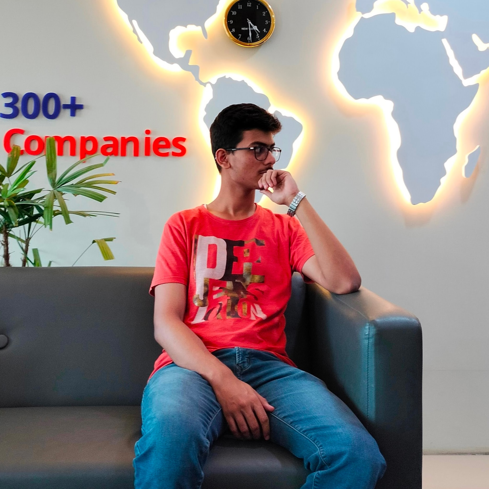

# About Us

## Who we are?

We are group of folks having a common goal to improve the public sector by inovating solutions which would increase the transparency

## Meet Our Team

    <a href="https://www.linkedin.com/in/sarvin-shrivastava-493b20176/" class="container" style="padding:0px 10px; text-align:center;">
        
         
        <strong style="color:white;">Sarvin Shrivastava</strong>
    </a>
    <a href="https://www.linkedin.com/in/satyagyasingh/" class="container" style="padding:0px 10px; text-align:center;">
        
         
        <strong style="color:white;">Satyagya Singh</strong>
    </a>
    <a href="https://www.linkedin.com/in/satyam-balaiwar-46617b244/" class="container" style="padding:0px 10px; text-align:center;">
        
         
        <strong style="color:white;">Satyam Balaiwar</strong>
    </a>
    <a href="https://www.linkedin.com/in/shashwatrai05/" class="container" style="padding:0px 10px;text-align:center;">
        
         
        <strong style="color:white;">Shashwat Rai</strong>
    </a>

## 🚀 Projects We're Working On

- **Pardarsh** – E-portal for public project transparency ✔️

## 🛠️ Tech Stack

## 💡 How to Contribute

We’re open to feedback, issue reports, and suggestions!
- Fork a [repo](https://github.com/orgs/pardarsh-portal/repositories)
- Create a PR under tag enhancement

## Reach Us Out
📨 Mail us at pardarsh.portal@gmail.com